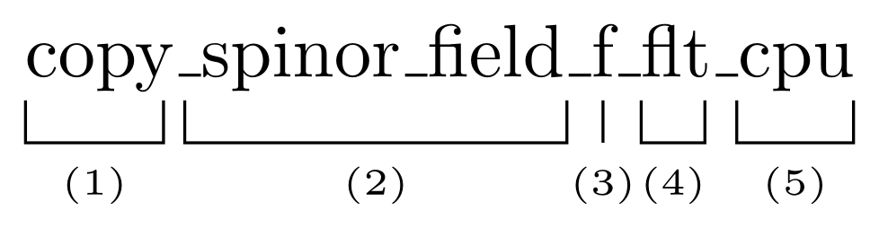

# Coding Conventions

## Function Names

Functions in `HiRep` need to be implemented for different field or site types, different representations, single and double precision as well as to run on CPU or with GPU acceleration. In order to avoid confusion, functions are named in a coherent matter using the following structure

Here, part (1) is the name of the operation performed. Following this is the type of the field structure or site elementary structure that the operation is performed on. (3) then denotes the representation of the structure. `f` denotes the fundamental representation. (4) indicates, whether the function assume single or double precision. The suffix `flt` (corresponding to `float`) denotes single precision , while the omission of this suffix denotes double precision. Finally, the suffixes `cpu` and `gpu` distinguish, whether this function operates on an object in the memory of either the host/CPU or device/GPU.

## Error Handling

### CUDA 