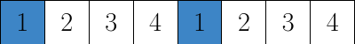

# Geometry of Field Data in Memory

## Summary

Section TODO:
* Add more pictures

Fields living on the 4-dimensional lattice are defined to be C arrays of elements using the data structures in the corresponding section. The geometry of the lattice is defined by assigning an index $n$ of the array to each site $(t, x, y, z)$. The mapping between the cartesian coordinates of the local lattice and the array index is given by the macros `iup(n,dir) and `idn(n,dir)` which, given the index $n$ of the current site, return the index of the site whose cartesian coordinate in direction `dir` is increased or decreased by one respectively. 

### Geometry Descriptor

In the MPI version of the code the set of indices which correspond the the local lattice are not all contiguous, instead the lattice is divided into different blocks. Each of these blocks then corresponds to a contiguous set of indices. As a result, we need to additionally allocate field memory for buffers that we can use to send and receive information between different cores and nodes. In order to communicate correctly, we need to first fill the buffer of data to be sent. The division of the local lattice into blocks, the location of the different buffers and buffer copies are described in the following C structure in `Include/geometry.h`.

```
typedef struct _geometry_descriptor
{
  int inner_master_pieces; 
  int local_master_pieces; 
  int total_spinor_master_pieces;
  int total_gauge_master_pieces;
  int *master_start, *master_end;
  int master_shift;
  int ncopies_spinor;
  int ncopies_gauge;
  int *copy_from, *copy_to, *copy_len;
  int copy_shift; 
  int nbuffers_spinor;
  int nbuffers_gauge;
  int *rbuf_len, *sbuf_len;
  int *rbuf_from_proc, *rbuf_start;
  int *sbuf_to_proc, *sbuf_start;
  int gsize_spinor;
  int gsize_gauge;
  int *fuse_mask;
  int fuse_gauge_size;
  int fuse_inner_counter;
} geometry_descriptor;

```

#### Number of Sites
In order to allocate memory for the field data, we need to know how many elementary field types we need to allocate. This is different for fields that are located on the sites or the links of the lattice. Correspondingly, for the given lattice geometry, the number of sites and the number of links are calculated and saved in the fields `gsize_spinor` and `gsize_gauge` respectively.

#### Master Pieces

##### Local Master Pieces
The local master pieces are the pieces of local lattices. A piece is called _master_ if it does not contain copies of other sites, as for example is the case for buffer pieces. These are copies of sites already stored in a master pieces. The field `local_master_pieces` identifies the number of local master pieces. 

For example, take a lattice of size $8^3\times 16$ split up with an MPI layout of `1.1.1.2` into two local lattices of size $8^4$. In addition to this decomposition, the blocks are even-odd preconditioned, meaning each of these local lattices will be split up again into a block of even and odd sites. We will end up with four blocks which are denoted _local master pieces_. The integer saved in `local_master_pieces` would therefore be equal to four. 

TODO:  illustration

##### Total Master Pieces
Additionally, the geometry descriptor contains two numbers of _total master pieces_, one for spinors and one for gauge fields. This counts the number of local master pieces plus the number of receive buffers, but not send buffers. The local master pieces including receive buffers can be thought of as an extension of the local lattice in the directions that are parallelized, i.e. the global lattice is split in this direction. Iterating over the total number of master pieces equates therefore to an iteration over the local lattices including their halo regions.

TODO: illustration


The number of interfacing elements does not only depend on this decomposition but also whether the saved field is saved on the lattice links or sites. Consequently, while the master pieces are identical, the buffer structure depends on whether the field that needs to be communicated is a gauge field or a spinor field. For this, the geometry descriptor contains both an integer for the total number of master pieces for a spinor field and the total number of master pieces for a gauge field. Additionally, there are fields that contain corresponding counts of buffers for both field geometries, `nbuffers_spinor` and `nbuffers_gauge`.

#### Block Arrangement Conventions
In order to work with the block structure efficiently and optimize memory access patterns, the sites belonging to a single piece are stored consecutively in memory. Since the field data is stored in a one-dimensional array, we can access the sites stored in a block by consecutive indices. As a result, in order to access all sites in a block, we need to know the index where it starts and where it ends. This information is stored in the arrays `master_start` and `master_end`. 

Here, every block is identified by an index, in the code often called `ixp`. The mapping of the index to the block is persistent but arbitrary aside from the convention, that the first indices will go to the local master pieces and higher indices then identify buffers. In order to find the starting index of a piece with index 5 belonging to a decomposed spinor field, one would write

```
spinor_field s = /* initialize a field */
int index_start = s->type->master_start[5];
```

One could find out the length of the block, which is not constant because the length of the buffer pieces is variable, by writing

```
int block_length = s-type->master_start[5] - s->type->master_end[5] + 1;
```

#### Buffer Synchronization
For complex decompositions, that are usual in lattice simulations, the blocks have to communicate in a highly non-trivial way. For example decomposing a $32^3\times 64$ lattice into $8^4$ local lattices requires 512 processes to communicate the three dimensional surfaces of each four-dimensional local lattice with all interfacing blocks. In order to perform this communication we need to know both the indices of the sending blocks and map them to the receiving blocks. This information is stored in the arrays `copy_from` and `copy_to`. I can iterate through these arrays to find pairs of sending and receiving blocks and perform the communication. The size of the memory transfer is further stored in the array `copy_len`.

#### Even-Odd Decomposition

As already mentioned it is convention to first store the local master pieces and then the receive buffers. In each of these subcategories, we want to also store first the even and then the odd blocks. For the local master pieces this means that there is a big block of memory containing all local master pieces that is split in two halfs of contiguous memory that contain all even or odd sites respectively. 

%% TODO illustration

Resultingly, there is a shift in the local master piece block that is the starting index of the odd sites, i.e. the index of the first odd entry in the full geometry. This index is identified by the integer `master_shift` in the geometry descriptor. 

Buffers are decomposed analogously, but split in two in the buffer block. 

TODO: illustration. Also make sure this is right, and we do not for some reason
split the complete thing in two.

The block index of the first odd copy in the full geometry is identified by the integer `copy_shift` in the geometry descriptor.

## Technical Details and Examples

### Even-Odd Decomposition
#### CPU
A sufficiently local operator only operates on the site value and its nearest neighbors.
As a result, we can decompose the operation into a step that can be executed site by site and is therefore diagonal and another step where every site only depends on the nearest neighbors. This we can further decompose into two steps, one acting on the even lattice sites while the odd sites are frozen and then another step acting on the odd lattice sites while the even ones are frozen. As a result, this decomposition enables us to effectively evaluate local operators on the lattice because it can be done in parallel, using multiple CPU cores or GPUs.
In order to efficiently work with this decomposition on the CPU and the GPU, the even and odd sites are stored in separate blocks on the lattice. This means for the CPU that for a field that is defined on both even and odd sites, one can easily iterate through the even sites by iterating through the first half of the allocated memory.

For example, for spinor fields, iterating through the even sites mechanically works as in the following:

```
#include "global.h"
#include "spinor_field.h"
#include "suN_types.h"
#include "memory.h"

int main(void)
{
    spinor_field *s;
    s = alloc_spinor_field_f(1, &glattice);
    int lattice_volume = T*X*Y*Z;
    for (int i = 0; i < lattice_volume/2; ++i)
    {
        suNf_spinor *site = s->ptr + i;
    }
}
```

We only iterate through half the lattice points. Iterating through the odd sites requires us to know the offset at which the odd indices begin. All information regarding lattice geometry is stored in the geometry descriptor.

```
#include "global.h"
#include "spinor_field.h"
#include "suN_types.h"
#include "memory.h"

int main(void)
{
    spinor_field *;
    s = alloc_spinor_field(1, &glattice);
    int lattice_volume = T*X*Y*Z;
    int offset = glat_odd->master_shift;

    for (int i = offset; i < lattice_volume; ++i)
    {
        suNf_spinor *site = s->ptr + i;
    }
}
```

In practice, the programmer should not be forced to think about lattice geometry. For this, the corresponding for loops are replaced by the macros ```_PIECE_FOR```, ```_SITE_FOR``` and ```_MASTER_FOR``` that are defined in ```Include/geometry.h```.

##### \_MASTER\_FOR
 This macro iterates over all sites without considering which piece they are located. For example, for the spinor field, this would simplify to

```
#include "global.h"
#include "spinor_field.h"
#include "suN_types.h"
#include "memory.h"
#include "geometry.h"

int main(void)
{
    spinor_field *s;

    // Allocate spinor that is defined on all sites
    s = alloc_spinor_field(1, &glattice);

    _MASTER_FOR(s->type, ix)
    {
        suNf_spinor *site = s->ptr+ix;
    }
}
```

Take $V$ to be the number of lattice sites. Then ```ix``` runs from 0 to $V-1$. If the lattice geometry is given as even, it runs from 0 to $\tfrac{V}{2}-1$. If it is odd, it runs from $\tfrac{V}{2}$ to $V-1$. It is possible to iterate over an even spinor in the following way

```
#include "global.h"
#include "spinor_field.h"
#include "suN_types.h"
#include "memory.h"
#include "geometry.h"

int main(void)
{
    spinor_field *s;

    // Allocate even spinor
    s = alloc_spinor_field(1, &glattice);

    _MASTER_FOR(s->type, ix)
    {
        suNf_spinor *site = s->ptr+ix;
    }
}
```

Nevertheless, iterating over an odd spinor the same way will yield a segmentation fault. This is because, in the odd spinor, only the odd sites are allocated starting at 0. As a result, we need to iterate from 0 to $\tfrac{V}{2}-1$ for the odd spinor. This, however, clashed with the fact that if we have a spinor that is defined on all lattice sites, we want to have the indices start at $\tfrac{V}{2}$. \par
To solve this problem, instead of accessing the elements directly, there is a macro that correctly accesses given a global index provided by either ```_SITE\_FOR``` or ```_MASTER_FOR```: ```_FIELD_AT``` in ```Include/spinor_field.h```.
The right way to iterate over any geometry is to use the following pattern, with the corresponding geometry substituted in the allocation function.

```
#include "global.h"
#include "spinor_field.h"
#include "suN_types.h"
#include "memory.h"
#include "geometry.h"

int main(void)
{
    spinor_field *s;

    // Allocate odd spinor
    s = alloc_spinor_field(1, &glat_odd);

    _MASTER_FOR(s->type, ix)
    {
        suNf_spinor *site = _FIELD_AT(s, ix);
    }
}
```

```_PIECE_FOR``` Depending on the operation we need to perform on the field, we might need to know whether we are currently operating on the even or the odd part of the field. Leaving aside MPI decomposition, which will be explained later, the field is decomposed into only two pieces: The odd and the even part. If the spinor is only odd or even, there will be only a single piece. An index labels the pieces often called ```ixp``` in the order they appear in memory. Therefore (without any MPI decomposition), the even part has the index ```ixp```=0, and the odd part ```ixp```=1.

```
#include "global.h"
#include "spinor_field.h"
#include "suN_types.h"
#include "memory.h"
#include "geometry.h"

int main(void)
{
    spinor_field *s;
    s = alloc_spinor_field(1, &glattice);

    _PIECE_FOR(s->type, ixp)
    {
        printf("Operating on piece: %d\n", ixp);
    }
}
```

```_SITE_FOR``` We can now decompose the ```_MASTER_FOR``` into ```_PIECE_FOR``` and ```_SITE_FOR```. This might be necessary if we want to iterate over the sites and always have the information on which piece we are currently operating.

```
#include "global.h"
#include "spinor_field.h"
#include "suN_types.h"
#include "memory.h"
#include "geometry.h"

int main(void)
{
    spinor_field *s;
    s = alloc_spinor_field(1, &glattice);

    _PIECE_FOR(s->type, ixp)
    {
        _SITE_FOR(s->type, ixp, ix)
        {
            printf("Operating on piece %d at index %d\n", ixp, ix);
        }
    }
}
```

##### GPU
We will not want to use any for-loop macros to iterate over the sites on the GPU. Instead, we want to distribute the operations on the sites over different threads. Further, in anticipation of a later MPI decomposition, any kernel operation on the fields should launch a separate kernel for each piece. At the point of a simple even-odd decomposition, we need to do the following:

* Wrap the kernel call in ```_PIECE_FOR```. This will take care of any block decomposition identically to the CPU.
* Only pass the odd or even block to the kernel at the correct offset. The global thread/block index will then be used to iterate over the sites, and we do not need to worry about any global indices. All the kernel knows about is the block. This serves as a replacement of ```_SITE_FOR```.
* Read out the field value for a given local block index having only the offset starting pointer at hand. Due to the special memory structure discussed in the next section, this has to be done using the GPU reading, and writing functions declared in ```Include/suN.h```. These serve as a replacement to ```_FIELD_AT```. They are not completely analogous because, depending on the structure, they do not read out the complete site. For the spinor field, for example, the reading must be done spinor component-wise.

For a spinor field in the fundamental representation, one would use the function ```read_gpu_suNf_vector``` because the components of the spinor are vectors, and it is necessary to read the spinor vector-wise. Further, to only pass the block the kernel is supposed to operate on, we are using the macro ```_GPU_FIELD_BLK``` in ```Include/gpu.h```. This macro takes the spinor field and the piece index ```ixp``` and returns the starting pointer of the local block in the GPU field data copy.

```
#include "global.h"
#include "spinor_field.h"
#include "suN_types.h"
#include "memory.h"
#include "geometry.h"

int main(void)
{
    // Define grid size and block size for kernel execution
    int grid_size = // number
    int block_size = // number

    // Stride that separated even and odd sites in memory is half the
    // number of lattice points
    int vol4h = T*X*Y*Z/2;
/
    spinor_field *s;
    s = allocate_spinor_field_f(1, &glattice);

    // Piece for is used identically to the CPU
    _PIECE_FOR(s->type, ixp) {
        // Local block is passed using _GPU_FIELD_BLK
        example_kernel<<<grid_size, block_size>>>(_GPU_FIELD_BLK(s,ixp), vol4h);
    }
}

__global__ void example_kernel(suNf_spinor *s, int vol4h, int block_size)
{
    // Local index on the block
    int ix = blockIdx.x * blockDim.x + threadIdx.x;
    suNf_spinor* site;

    // Only perform the operation if the index is on the block
    if (ix < vol4h)
    {
        // Read out the spinor component-wise
        for (int component = 0; component < 4; component++)
        {
            read_gpu_suNf_vector(vol4h, (*site).c[component], s, ix, component);
        }
    }
}
```

Reading an element of the gauge field is slightly different. We can transfer the loop over the different pieces, but since the gauge field is a vector field, we have more components to consider. Therefore we need to replace ```_GPU_FIELD_BLK``` with ```_GPU_4FIELD_BLK```. For the gauge field the readout functions is simply ```read_gpu_suNf```, which is also located in ```suN.h```. This function reads out the vector component-wise.

```
#include "global.h"
#include "spinor_field.h"
#include "suN_types.h"
#include "memory.h"
#include "geometry.h"

int main(void)
{
    // Define grid size and block size for kernel execution
    int grid_size = // number
    int block_size = // number

    // Stride that separated even and odd sites in memory is half the
    // number of lattice points
    int vol4h = T*X*Y*Z/2;

    suNf_field *u;
    u = allocate_gfield_f(&glattice);

    // Piece for is used identically to the CPU
    _PIECE_FOR(s->type, ixp) {
        // Local block is passed using _GPU_4FIELD_BLK
        example_kernel<<<grid_size, block_size>>>(_GPU_4FIELD_BLK(u,ixp), vol4h);
    }
}

__global__ void example_kernel(suNf_spinor *s, int vol4h, int block_size)
{
    // Local index on the block
    int ix = blockIdx.x * blockDim.x + threadIdx.x;
    suNf* site;

    // Only perform the operation if the index is on the block
    if (ix < vol4h)
    {
        for (int direction = 0; direction < 4; direction++)
        {
            read_gpu_suNf(vol4h, *site, s, ix, direction);
        }
    }
}
```

The writing functions work analogous.

### Contingency
These reading and writing functions are necessary to access memory in a contingent way when performing operations on the fields. If we store the spinors in the same way they are stored on the CPU this will not be contingent. To understand the problem, we can look at the implementation of the inner product of two spinors at the kernel level.

```
// <s1,s2>
template< typename COMPLEX>
__global__ void spinor_field_prod_gpu(COMPLEX* s1, COMPLEX* s2, hr_complex* resField, int N)
{
  for (int i = blockIdx.x * blockDim.x + threadIdx.x;
       i < N;
       i += blockDim.x * gridDim.x)
    {
       resField[i] = _complex_prod(s1[i],s2[i]);
    }
}
```

In every thread we iterate over the components of the input arrays ```s1``` and ```s2```. Which are located at the same site. The different threads in this kernel now operate on the different sites of the lattice. Now, when this kernel is launched, the threads all try first to access all the first elements of all sites. However, when the sites are stored identically as on the CPU, this means that we access memory segments separated by a stride, as in the following illustration:



We can optimize this significantly by not saving one site after another but instead saving first all first components, then all seconds components and so on in the order they are accessed in the loop.


This means that memory is accessed contiguously as a single block. This is more efficient because it maximizes bus utilization and L1 cache hit rate.

#### Spinor Fields
At a code level, this is achieved by requesting the start pointer at a given index as usual, then performing a cast to the corresponding complex type and writing or reading from memory a stride away. For example, if one wanted to read out the second component of the first component vector of a spinor on the CPU, one would do that as follows

```
#include "spinor_field.h"
#include "suN.h"
#include "random.h"
#include "memory.h"

int void(main)
{
    spinor_field *field;
    field = alloc_spinor_field_f(1, &glattice);
    gaussian_spinor_field(field);

    suNf_spinor *s;
    int ix = 5; // For example
    s = field->ptr + ix;

    // Access second vector component of first spinor component
    hr_complex component = s.c[0].c[1];
}
```

On the GPU, this would be done in the following way

```
#include "spinor_field.h"
#include "suN.h"
#include "random.h"
#include "memory.h"

int void(main)
{
    // Initialize a random spinor field
    spinor_field *field;
    field = alloc_spinor_field_f(1, &glattice);
    gaussian_spinor_field(field);
    spinor_field_copy_to_gpu_f(field);

    // Kernel launch parameters
    int block_size = // plug in value
    int grid_size = // plug in value

    // The stride by which the components are separated
    // First we save the even sites component wise and then
    // the odd sites component wise.
    int stride = T*X*Y*Z/2;

    example_kernel<<<grid_size, block_size>>>(field->gpu_ptr, stride);
}

__global__ void example_kernel(suNf_spinor *start, int stride)
{
    int ix = blockIdx.x * blockDim.x + threadIdx.x;

    // Cast to a complex pointer. On the CPU start_as_complex++ would give us
    // the next component. Here we need to jump by a stride
    hr_complex *start_as_complex = (hr_complex*)start;

    // We can read out the first component using the index, because the first
    // components are arranged in a block of complex numbers of half the
    // lattice size.
    hr_complex first_component = start_as_complex + ix;

    // The second component is removed from the first component by the stride.
    hr_complex second_component = first_component + stride;
}
```


This shuffles how the ```struct```s are organized in the previously allocated space.


#### Gauge Fields
For the gauge fields for every site, there are four link directions. Since the matrices stored on the links can be complex or real, the real and imaginary part of the matrices are additionally separated by a stride. 

### MPI 
