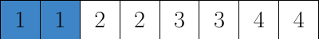

# Field Geometry on GPUs
In ```HiRep```, field data is stored in field ```struct```s that contain an array of values on sites or links that will be allocated on the CPU and one that will be allocated on the GPU. The definitions of different fields are defined in ```LibHR/spinor_field.h```. New field types can be declared by using the macro

```
#define _DECLARE_FIELD_STRUCT(_name, _type) \
  typedef struct _##_name                   \
  {                                         \
    _type *ptr;                             \
    geometry_descriptor *type;              \
    _MPI_FIELD_DATA                         \
    _GPU_FIELD_DATA(_type)                  \
  } _name
```

The ```_name``` will define the field's new name, which can be anything, while the ```_type``` variable has to refer to a type that was already defined. ```_type``` defines the types of values on the lattice sites.

The field value copy of the CPU is defined by ```_type *ptr```, which is a 1D array containing the field's values at the lattice sites. The GPU copy is hidden behind the macro ```_GPU_FIELD_DATA(_type)```.

```
#define _GPU_FIELD_DATA(_type)
#ifdef WITH_GPU
#undef _GPU_FIELD_DATA
#define _GPU_FIELD_DATA(_type) _type *gpu_ptr;
#endif //WITH_MPI
```

We need this macro instead of outright declaring the copy because we do not want to have a GPU copy in the field ```struct```s if we are only compiling for CPU. As can be seen from the macro ```_GPU_FIELD_DATA(_type)``` is defined to return nothing, but in the case of compilation with GPUs, it is overwritten to give a 1D array called ```gpu_ptr```, which can later be allocated on and accessed from the device.


Since memory access patterns have a high impact on application performance, the way that field data is stored on the GPU is different from how it is stored on the CPU in several ways that will be explained in the following. Further, ```HiRep``` does not support unified memory, which implies that from a kernel, only pointers to sites will be available but not the complete field structures, which has an impact on which functions and macros that work on the CPU are available to call from a CUDA kernel. \par

For example, if we declare a spinor field

```
spinor_field *s;
```

we may access its geometry description and sites on the CPU from a regular host function
```
int main(void)
{
    spinor_field *s;

    // Query the value at the site with index 0
    suNf_spinor *field_value = s->ptr;

    // Check, whether the spinor field is odd
    if (s->type == &glat_odd) printf("Spinor is odd.\n")

    suNf_spinor *gpu_field_value = s->gpu_ptr;
    // This fails, because it points to memory allocated on the GPU
    // and is therefore unavailable from the host.
    suNf_vector spinor_comp = (*gpu_field_value).c[0];
}
```

In a kernel, it is impossible to check whether the spinor is even or odd. Every call to the spinor field structure will fail.

```
__global__ void example_kernel(spinor_field *s)
{
    // This fails because s is a host pointer, unless it was transferred
    // before being passed to the kernel.
    suNf_spinor *field_value = s->ptr;

    // This fails because the geometry descriptor is saved on the host
    if (s->type == &glat_odd) printf("Spinor is odd.\n");

    // This fails, because s is located on the host and it is accessed in
    // order to access the field
    suNf_spinor *gpu_field_value = s->gpu_ptr;
}
```

The correct way to run a kernel that operates on the GPU field data copy is to pass the first site in the copy to the kernel and then access other sites. For example


```
__global__ void example_kernel(suNf_spinor *start)
{
    int ix = blockIdx.x * blockDim.x  + threadIdx.x;
    // Get site with index ix
    suNf_spinor *site = start+ix;
}
```

The index in the 1D array is bijectively mapped to the coordinates in space and time.

## Even-Odd Decomposition
### CPU
A sufficiently local operator only operates on the site value and its nearest neighbors.
As a result, we can decompose the operation into a step that can be executed site by site and is therefore diagonal and another step where every site only depends on the nearest neighbors. This we can further decompose into two steps, one acting on the even lattice sites while the odd sites are frozen and then another step acting on the odd lattice sites while the even ones are frozen. As a result, this decomposition enables us to effectively evaluate local operators on the lattice because it can be done in parallel, using multiple CPU cores or GPUs.
In order to efficiently work with this decomposition on the CPU and the GPU, the even and odd sites are stored in separate blocks on the lattice. This means for the CPU that for a field that is defined on both even and odd sites, one can easily iterate through the even sites by iterating through the first half of the allocated memory.

For example, for spinor fields, iterating through the even sites mechanically works as in the following:

```
#include "global.h"
#include "spinor_field.h"
#include "suN_types.h"
#include "memory.h"

int main(void)
{
    spinor_field *s;
    s = alloc_spinor_field_f(1, &glattice);
    int lattice_volume = T*X*Y*Z;
    for (int i = 0; i < lattice_volume/2; ++i)
    {
        suNf_spinor *site = s->ptr + i;
    }
}
```

We only iterate through half the lattice points. Iterating through the odd sites requires us to know the offset at which the odd indices begin. All information regarding lattice geometry is stored in the geometry descriptor.

```
#include "global.h"
#include "spinor_field.h"
#include "suN_types.h"
#include "memory.h"

int main(void)
{
    spinor_field *;
    s = alloc_spinor_field(1, &glattice);
    int lattice_volume = T*X*Y*Z;
    int offset = glat_odd->master_shift;

    for (int i = offset; i < lattice_volume; ++i)
    {
        suNf_spinor *site = s->ptr + i;
    }
}
```

In practice, the programmer should not be forced to think about lattice geometry. For this, the corresponding for loops are replaced by the macros ```_PIECE_FOR```, ```_SITE_FOR``` and ```_MASTER_FOR``` that are defined in ```Include/geometry.h```.

#### \_MASTER\_FOR
 This macro iterates over all sites without considering which piece they are located. For example, for the spinor field, this would simplify to

```
#include "global.h"
#include "spinor_field.h"
#include "suN_types.h"
#include "memory.h"
#include "geometry.h"

int main(void)
{
    spinor_field *s;

    // Allocate spinor that is defined on all sites
    s = alloc_spinor_field(1, &glattice);

    _MASTER_FOR(s->type, ix)
    {
        suNf_spinor *site = s->ptr+ix;
    }
}
```

Take $V$ to be the number of lattice sites. Then ```ix``` runs from 0 to $V-1$. If the lattice geometry is given as even, it runs from 0 to $\tfrac{V}{2}-1$. If it is odd, it runs from $\tfrac{V}{2}$ to $V-1$. It is possible to iterate over an even spinor in the following way

```
#include "global.h"
#include "spinor_field.h"
#include "suN_types.h"
#include "memory.h"
#include "geometry.h"

int main(void)
{
    spinor_field *s;

    // Allocate even spinor
    s = alloc_spinor_field(1, &glattice);

    _MASTER_FOR(s->type, ix)
    {
        suNf_spinor *site = s->ptr+ix;
    }
}
```

Nevertheless, iterating over an odd spinor the same way will yield a segmentation fault. This is because, in the odd spinor, only the odd sites are allocated starting at 0. As a result, we need to iterate from 0 to $\tfrac{V}{2}-1$ for the odd spinor. This, however, clashed with the fact that if we have a spinor that is defined on all lattice sites, we want to have the indices start at $\tfrac{V}{2}$. \par
To solve this problem, instead of accessing the elements directly, there is a macro that correctly accesses given a global index provided by either ```_SITE\_FOR``` or ```_MASTER_FOR```: ```_FIELD_AT``` in ```Include/spinor_field.h```.
The right way to iterate over any geometry is to use the following pattern, with the corresponding geometry substituted in the allocation function.

```
#include "global.h"
#include "spinor_field.h"
#include "suN_types.h"
#include "memory.h"
#include "geometry.h"

int main(void)
{
    spinor_field *s;

    // Allocate odd spinor
    s = alloc_spinor_field(1, &glat_odd);

    _MASTER_FOR(s->type, ix)
    {
        suNf_spinor *site = _FIELD_AT(s, ix);
    }
}
```

```_PIECE_FOR``` Depending on the operation we need to perform on the field, we might need to know whether we are currently operating on the even or the odd part of the field. Leaving aside MPI decomposition, which will be explained later, the field is decomposed into only two pieces: The odd and the even part. If the spinor is only odd or even, there will be only a single piece. An index labels the pieces often called ```ixp``` in the order they appear in memory. Therefore (without any MPI decomposition), the even part has the index ```ixp```=0, and the odd part ```ixp```=1.

```
#include "global.h"
#include "spinor_field.h"
#include "suN_types.h"
#include "memory.h"
#include "geometry.h"

int main(void)
{
    spinor_field *s;
    s = alloc_spinor_field(1, &glattice);

    _PIECE_FOR(s->type, ixp)
    {
        printf("Operating on piece: %d\n", ixp);
    }
}
```

```_SITE_FOR``` We can now decompose the ```_MASTER_FOR``` into ```_PIECE_FOR``` and ```_SITE_FOR```. This might be necessary if we want to iterate over the sites and always have the information on which piece we are currently operating.

```
#include "global.h"
#include "spinor_field.h"
#include "suN_types.h"
#include "memory.h"
#include "geometry.h"

int main(void)
{
    spinor_field *s;
    s = alloc_spinor_field(1, &glattice);

    _PIECE_FOR(s->type, ixp)
    {
        _SITE_FOR(s->type, ixp, ix)
        {
            printf("Operating on piece %d at index %d\n", ixp, ix);
        }
    }
}
```

### GPU
We will not want to use any for-loop macros to iterate over the sites on the GPU. Instead, we want to distribute the operations on the sites over different threads. Further, in anticipation of a later MPI decomposition, any kernel operation on the fields should launch a separate kernel for each piece. At the point of a simple even-odd decomposition, we need to do the following:

* Wrap the kernel call in ```_PIECE_FOR```. This will take care of any block decomposition identically to the CPU.
* Only pass the odd or even block to the kernel at the correct offset. The global thread/block index will then be used to iterate over the sites, and we do not need to worry about any global indices. All the kernel knows about is the block. This serves as a replacement of ```_SITE_FOR```.
* Read out the field value for a given local block index having only the offset starting pointer at hand. Due to the special memory structure discussed in the next section, this has to be done using the GPU reading, and writing functions declared in ```Include/suN.h```. These serve as a replacement to ```_FIELD_AT```. They are not completely analogous because, depending on the structure, they do not read out the complete site. For the spinor field, for example, the reading must be done spinor component-wise.

For a spinor field in the fundamental representation, one would use the function ```read_gpu_suNf_vector``` because the components of the spinor are vectors, and it is necessary to read the spinor vector-wise. Further, to only pass the block the kernel is supposed to operate on, we are using the macro ```_GPU_FIELD_BLK``` in ```Include/gpu.h```. This macro takes the spinor field and the piece index ```ixp``` and returns the starting pointer of the local block in the GPU field data copy.

```
#include "global.h"
#include "spinor_field.h"
#include "suN_types.h"
#include "memory.h"
#include "geometry.h"

int main(void)
{
    // Define grid size and block size for kernel execution
    int grid_size = // number
    int block_size = // number

    // Stride that separated even and odd sites in memory is half the
    // number of lattice points
    int vol4h = T*X*Y*Z/2;

    spinor_field *s;
    s = allocate_spinor_field_f(1, &glattice);

    // Piece for is used identically to the CPU
    _PIECE_FOR(s->type, ixp) {
        // Local block is passed using _GPU_FIELD_BLK
        example_kernel<<<grid_size, block_size>>>(_GPU_FIELD_BLK(s,ixp), vol4h);
    }
}

__global__ void example_kernel(suNf_spinor *s, int vol4h, int block_size)
{
    // Local index on the block
    int ix = blockIdx.x * blockDim.x + threadIdx.x;
    suNf_spinor* site;

    // Only perform the operation if the index is on the block
    if (ix < vol4h)
    {
        // Read out the spinor component-wise
        for (int component = 0; component < 4; component++)
        {
            read_gpu_suNf_vector(vol4h, (*site).c[component], s, ix, component);
        }
    }
}
```

Reading an element of the gauge field is slightly different. We can transfer the loop over the different pieces, but since the gauge field is a vector field, we have more components to consider. Therefore we need to replace ```_GPU_FIELD_BLK``` with ```_GPU_4FIELD_BLK```. For the gauge field the readout functions is simply ```read_gpu_suNf```, which is also located in ```suN.h```. This function reads out the vector component-wise.

```
#include "global.h"
#include "spinor_field.h"
#include "suN_types.h"
#include "memory.h"
#include "geometry.h"

int main(void)
{
    // Define grid size and block size for kernel execution
    int grid_size = // number
    int block_size = // number

    // Stride that separated even and odd sites in memory is half the
    // number of lattice points
    int vol4h = T*X*Y*Z/2;

    suNf_field *u;
    u = allocate_gfield_f(&glattice);

    // Piece for is used identically to the CPU
    _PIECE_FOR(s->type, ixp) {
        // Local block is passed using _GPU_4FIELD_BLK
        example_kernel<<<grid_size, block_size>>>(_GPU_4FIELD_BLK(u,ixp), vol4h);
    }
}

__global__ void example_kernel(suNf_spinor *s, int vol4h, int block_size)
{
    // Local index on the block
    int ix = blockIdx.x * blockDim.x + threadIdx.x;
    suNf* site;

    // Only perform the operation if the index is on the block
    if (ix < vol4h)
    {
        for (int direction = 0; direction < 4; direction++)
        {
            read_gpu_suNf(vol4h, *site, s, ix, direction);
        }
    }
}
```

The writing functions work analogous.

## Contingency
These reading and writing functions are necessary to access memory in a contingent way when performing operations on the fields. If we store the spinors in the same way they are stored on the CPU this will not be contingent. To understand the problem, we can look at the implementation of the inner product of two spinors at the kernel level.

```
// <s1,s2>
template< typename COMPLEX>
__global__ void spinor_field_prod_gpu(COMPLEX* s1, COMPLEX* s2, hr_complex* resField, int N)
{
  for (int i = blockIdx.x * blockDim.x + threadIdx.x;
       i < N;
       i += blockDim.x * gridDim.x)
    {
       resField[i] = _complex_prod(s1[i],s2[i]);
    }
}
```

In every thread we iterate over the components of the input arrays ```s1``` and ```s2```. Which are located at the same site. The different threads in this kernel now operate on the different sites of the lattice. Now, when this kernel is launched, the threads all try first to access all the first elements of all sites. However, when the sites are stored identically as on the CPU, this means that we access memory segments separated by a stride, as in the following illustration:


We can optimize this significantly by not saving one site after another but instead saving first all first components, then all seconds components and so on in the order they are accessed in the loop.



This means that memory is accessed contiguously as a single block. This is more efficient because it maximizes bus utilization and L1 cache hit rate.

#### Spinor Fields
At a code level, this is achieved by requesting the start pointer at a given index as usual, then performing a cast to the corresponding complex type and writing or reading from memory a stride away. For example, if one wanted to read out the second component of the first component vector of a spinor on the CPU, one would do that as follows

```
#include "spinor_field.h"
#include "suN.h"
#include "random.h"
#include "memory.h"

int void(main)
{
    spinor_field *field;
    field = alloc_spinor_field_f(1, &glattice);
    gaussian_spinor_field(field);

    suNf_spinor *s;
    int ix = 5; // For example
    s = field->ptr + ix;

    // Access second vector component of first spinor component
    hr_complex component = s.c[0].c[1];
}
```

On the GPU, this would be done in the following way

```
#include "spinor_field.h"
#include "suN.h"
#include "random.h"
#include "memory.h"

int void(main)
{
    // Initialize a random spinor field
    spinor_field *field;
    field = alloc_spinor_field_f(1, &glattice);
    gaussian_spinor_field(field);
    spinor_field_copy_to_gpu_f(field);

    // Kernel launch parameters
    int block_size = // plug in value
    int grid_size = // plug in value

    // The stride by which the components are separated
    // First we save the even sites component wise and then
    // the odd sites component wise.
    int stride = T*X*Y*Z/2;

    example_kernel<<<grid_size, block_size>>>(field->gpu_ptr, stride);
}

__global__ void example_kernel(suNf_spinor *start, int stride)
{
    int ix = blockIdx.x * blockDim.x + threadIdx.x;

    // Cast to a complex pointer. On the CPU start_as_complex++ would give us
    // the next component. Here we need to jump by a stride
    hr_complex *start_as_complex = (hr_complex*)start;

    // We can read out the first component using the index, because the first
    // components are arranged in a block of complex numbers of half the
    // lattice size.
    hr_complex first_component = start_as_complex + ix;

    // The second component is removed from the first component by the stride.
    hr_complex second_component = first_component + stride;
}
```


This shuffles how the ```struct```s are organized in the previously allocated space.


### Gauge Fields
For the gauge fields for every site, there are four link directions. These directions are now stored analogously to the vector components in the spinor field separated by a stride.
